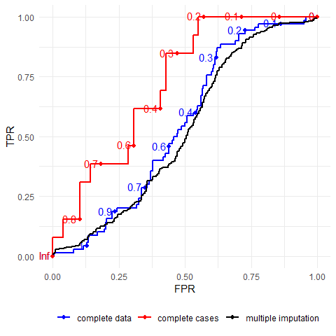
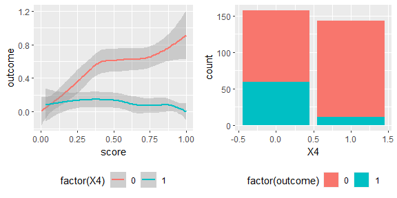

rocmice
================

# Introduction

`rocmice` is an R package to work with ROC (Receiver Operating Curves)
in multiply imputed data. Using multiple imputation in prediction
modelling can be helpful when missingness patterns don’t follow MCAR and
complete case analysis, single imputation or similar methods could
seriously bias the model. Using pooled ROC and AUC makes evaluation of
such models easier.

# Installation

You can install the package with

``` r
# install.packages("devtools")
devtools::install_github("https://github.com/jonas-schropp/rocmice.git")
```

And then call it like any other package using

``` r
library(rocmice)
```

# Usage

## Use case

To illustrate the use of `rocmice` we use an especially pathological
simulated data set. To learn more how it was created and what makes ROC
analysis on this data set tricky, call

``` r
data(patho)
help("patho")
```

    ## starting httpd help server ... done

Notable, it contains a binary variable `outcome` that represents some
kind of status, for example presence of a disease and a `score` that
represents the result of some kind of predictive / diagnostic algorithm
(it was calculated as `invlogit(0.5 * X1 + X2 + 1.5 * X3)`). This score
performs worse when `X4` is 1 then when it is 0.

## Pooling the AUC

We can calculate the AUC for each imputation using `pROC::roc`.

``` r
rocs <- list()
for (i in 1:length(patho$patho_imp)) {
  rocs[[i]] <- pROC::roc(
    outcome ~ score, 
    data = patho$patho_imp[[i]],
    direction = ">", levels = c(0, 1)
    )
}
```

And then pool it with `pool_auc_rr`:

``` r
pool_auc_rr(rocs, ci.level = 0.95, transform = "logit")
```

    ##         auc        ll        ul auc_logit var_total_logit var_between_logit
    ## 1 0.4749906 0.3933517 0.5579887 -0.100121      0.02749194       0.006515622
    ##   var_within_logit
    ## 1       0.01967319

## Plotting the ROC curve

First we pool the ROC for the imputed data sets using `pool_roc_rr`:

``` r
pooled_roc <- pool_roc_rr(
    data = patho$patho_imp,
    score = "score",
    target = "outcome",
    unique_vals = NULL,
    fpr_vals = seq(from=0.001, to=0.999, by=0.001),
    backtransform = TRUE,
    ci.level = 0.95,
    corr = 0.5,
    verbose = TRUE
)
```

    ## 
    ## Calculating TPR for every FPR: 
    ## ================================================================================
    ## Combining and pooling results.

Then we plot the ROC for the complete data set and the complete cases
from the data set with missing values using `plotROC::geom_roc` and add
the pooled ROC created with `pool_roc_rr` using `ggplot::geom_step`:

``` r
ggplot() + 
  geom_roc(
    data = patho$patho_complete, 
    aes(m = score, d = outcome, color = 'complete data')
    ) +
  geom_roc(
    data = patho$patho_amp, 
    aes(m = score, d = outcome, color = 'complete cases')
    ) +
  geom_step(
    data = pooled_roc, 
    aes(fpr, roc, color = 'multiple imputation'), 
    size = 1
    ) +
  labs(x = "FPR", y = "TPR") +
  theme_minimal() +
  scale_color_manual(
    breaks = c(
      'complete data', 
      'complete cases', 
      'multiple imputation'
      ),
    values = c(
      'complete data'='blue', 
      'complete cases'='red', 
      'multiple imputation'='black'
      )
    ) +
  theme(
    legend.title = element_blank(),
    legend.position = "bottom"
    )
```

<!-- -->

It is easy to see that the ROC created from multiply imputed data
closely tracks the one on a complete data set without missing values,
while the one on complete cases shows an overly optimistic bias.

## Comparing the AUC between two groups

We rely on `pROC::roc` for the calculation of the ROC for each group and
imputation.

``` r
g1 <- list()
g2 <- list()
for (i in 1:length(patho$patho_imp)) {
  
  g1[[i]] <- pROC::roc(
    outcome ~ score, 
    data = patho$patho_imp[[i]][patho$patho_imp[[i]]$X4 == 0, ],
    direction = ">", levels = c(0, 1)
    )
  g2[[i]] <- pROC::roc(
    outcome ~ score, 
    data = patho$patho_imp[[i]][patho$patho_imp[[i]]$X4 == 1, ],
    direction = ">", levels = c(0, 1)
    )
}
```

To compare the area under the curve, we rely on a modified version of
Delong’s test that pools the variance of AUC1 - AUC2 within and between
each imputation using Rubin’s Rules.

``` r
mi_roc_test(g1, g2, paired = FALSE)
```

    ##    delta_auc   t.value      p.value  var.total var.within var.between
    ## 1 -0.4382247 -4.662933 6.173937e-06 0.09398048 0.09036396 0.003013763
    ##          riv     lambda       fmi
    ## 1 0.04002165 0.03848156 0.0493133

## Comparing the AUC for two scores

We could now rightfully decide that our score needs to be updated to
account for the unfair bias against group 1. It’s obvious that the score
performs much better in group 0 than group 1.

``` r
pl1 <- ggplot(patho$patho_imp[[1]], aes(score, outcome, group = factor(X4), color = factor(X4))) + 
  geom_smooth(method = 'loess', formula = 'y ~ x') +
  theme(legend.position = "bottom")

pl2 <- ggplot(patho$patho_imp[[1]], aes(X4, fill = factor(outcome))) + 
  geom_bar() +
  theme(legend.position = "bottom")

ggpubr::ggarrange(pl1, pl2)
```

<!-- -->

It does appear like group 1 is also several times less likely to suffer
from the outcome condition, so we could incorporate that information
into a new score.

``` r
calc_score2 <- function(d) {
  eta <- 0.5 * d[["X1"]] + d[["X2"]] + 1.5 * d[["X3"]] + 4 * d[["X4"]]
  rocmice:::invlogit(eta)
}
```

We can again loop over each imputation to calculate the ROC (you can of
course also use `with` or `lapply` or `map` if you prefer) and then
compare the two lists using `mi_roc_test`.

``` r
g1 <- list()
g2 <- list()
for (i in 1:length(patho$patho_imp)) {
  
  patho$patho_imp[[i]]$score2 <- calc_score2(patho$patho_imp[[i]])
  
  g1[[i]] <- pROC::roc(
    outcome ~ score, 
    data = patho$patho_imp[[i]],
    direction = ">", levels = c(0, 1)
    )
  g2[[i]] <- pROC::roc(
    outcome ~ score2, 
    data = patho$patho_imp[[i]],
    direction = ">", levels = c(0, 1)
    )
}

mi_roc_test(g1, g2, paired = TRUE)
```

    ##    delta_auc         Z     p.value    var.total   var.within  var.between
    ## 1 -0.1204099 -5.517085 3.44668e-08 0.0004763271 0.0004185918 4.811273e-05
    ##         riv    lambda       fmi
    ## 1 0.1379274 0.1212093 0.1275944
