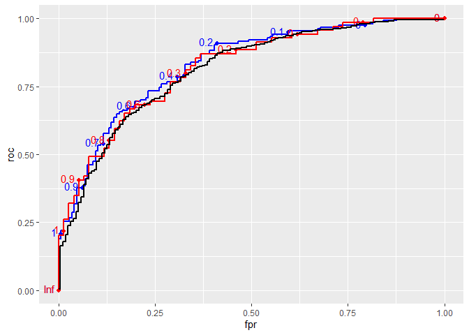

rocmice
================

# Introduction

`rocmice` is an R package to work with ROC (Receiver Operating Curves)
in multiply imputed data. Using multiple imputation in prediction
modelling can be helpful when missingness patterns don’t follow MCAR and
complete case analysis, single imputation or similar methods could
seriously bias the model. Using pooled ROC and AUC makes evaluation of
such models easier.

# Installation

You can install the package with

``` r
# install.packages("devtools")
devtools::install_github("https://github.com/jonas-schropp/rocmice.git")
```

And then call it like any other package using

``` r
library(rocmice)
```

# Usage

## Use case / data simulation

To illustrate the use of `rocmice` let’s simulate a data set:

``` r
library(MASS)

#set.seed(101)

# simulate from multivariate normal
n <- 300
mu <- rep(0, 10)
Sigma <- matrix(0.6, nrow=10, ncol=10)
diag(Sigma) <- 1
df_complete <- data.frame(mvrnorm(n = n, mu = mu, Sigma = Sigma))
df_complete[,10] <- abs(df_complete[,10])

# Simulate the outcome variable
eta <- 0.573 * df_complete[[1]] + 
  0.956 * df_complete[[2]] + 
  1.333 * df_complete[[3]] + 
  -3 * df_complete[[4]] + 
  3 * df_complete[[5]] + 
  rnorm(300, 0, 1)

outcome <- rbinom(300, 1, rocmice:::invlogit(eta))
```

Add missing values following MAR:

``` r
library(mice)
```

    ## 
    ## Attaching package: 'mice'

    ## The following object is masked from 'package:stats':
    ## 
    ##     filter

    ## The following objects are masked from 'package:base':
    ## 
    ##     cbind, rbind

``` r
amp0 <- ampute(
  data = df_complete,
  prop = 0.8,
  mech = "MAR"
)

patterns <- matrix(1, 6, 11)
colnames(patterns) <- c(paste0("X", 1:10), "outcome")
patterns[6,1:3] <- 0
diag(patterns[1:5, 1:5]) <- 0
weights <- patterns
weights[,"outcome"] <- 5
weights[6,4] <- -10
weights[6,5] <- 10

df_complete$outcome <- outcome

df_miss <- ampute(
  data = df_complete,
  patterns = patterns,
  prop = 0.8,
  mech = "MAR"
)$amp

# Add the outcome
#df_miss$outcome <- outcome
```

And impute them again:

## Fit models

Now say we have some kind of score that is supposed to predict the
outcome:

``` r
df_complete$outcome <- outcome

calc_score <- function(x1, x2, x3, x4, x5) {
  eta <- 0.5 * x1 + x2 + 1.5 * x3# + 2 * x4 + x5
  rocmice:::invlogit(eta)
}

df_complete$score <- calc_score(
  df_complete[[1]], df_complete[[2]], 
  df_complete[[3]], df_complete[[4]], 
  df_complete[[5]]
  )
df_miss$score <- calc_score(
  df_miss[[1]], df_miss[[2]], 
  df_miss[[3]], df_miss[[4]], 
  df_miss[[5]]
  )
for (i in 1:length(df_imp)) {
  df_imp[[i]]$score <- calc_score(
  df_imp[[i]][[1]], df_imp[[i]][[2]], 
  df_imp[[i]][[3]], df_imp[[i]][[4]], 
  df_imp[[i]][[5]]
  )
}
```

## Plotting the ROC curve

``` r
library(plotROC)
```

    ## Loading required package: ggplot2

``` r
library(ggplot2)
library(ggpubr)

pl_complete <- ggplot(df_complete, aes(m = score, d = outcome)) + geom_roc()
pl_miss <- ggplot(df_miss, aes(m = score, d = outcome)) + geom_roc()
```

``` r
pooled_roc <- pool_roc_rr(
    data = df_imp,
    score = "score",
    target = "outcome",
    unique_vals = NULL,
    fpr_vals = seq(from=0.001, to=0.999, by=0.001),
    backtransform = TRUE,
    ci.level = 0.95,
    corr = 0.5,
    verbose = TRUE
)
```

    ## 
    ## Calculating TPR for every FPR: 
    ## ================================================================================
    ## Combining and pooling results.

``` r
pl_pooled <- ggplot(pooled_roc, aes(fpr, roc)) +
  geom_ribbon(aes(ymin = ll_roc, ymax = ul_roc), alpha = 0.4) +
  geom_step()
```

``` r
ggarrange(pl_complete, pl_miss, pl_pooled, nrow = 1, ncol = 3)
```

<!-- -->

``` r
ggplot() + 
  geom_roc(data = df_complete, aes(m = score, d = outcome), color = "blue") +
  geom_roc(data = df_miss, aes(m = score, d = outcome), color = "red") +
  geom_step(data = pooled_roc, aes(fpr, roc), color = "black", size = 1)
```

<!-- -->
